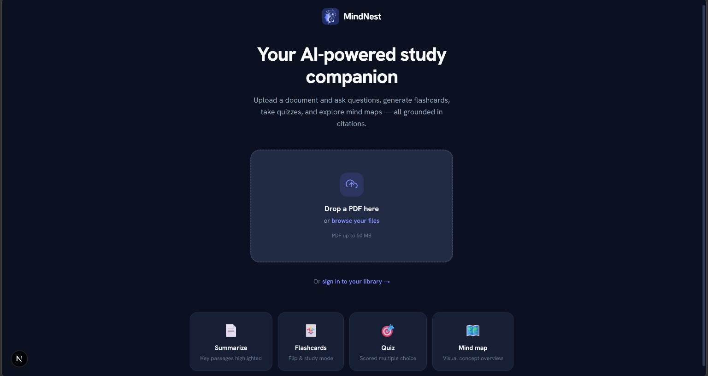
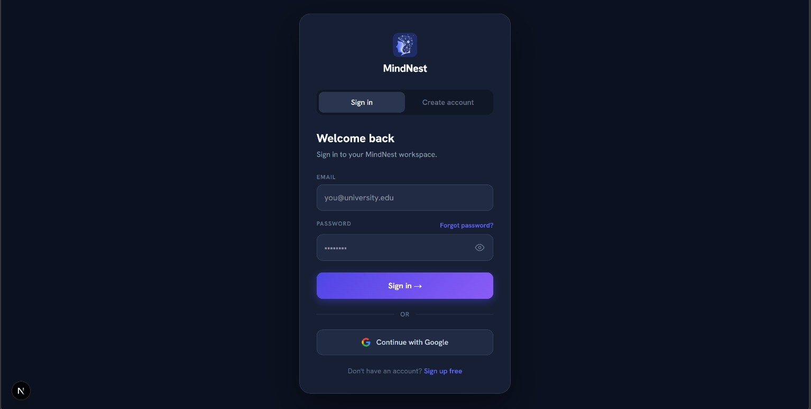
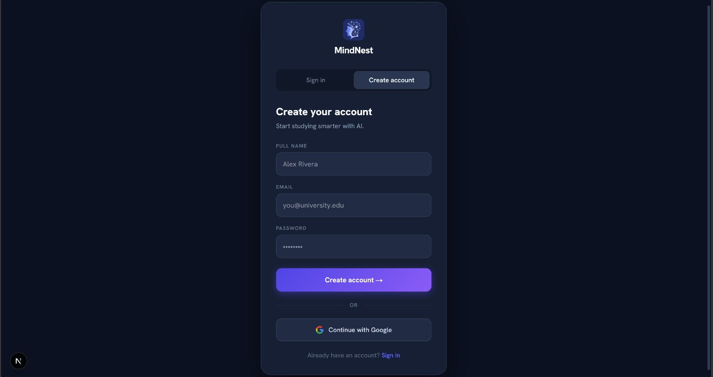
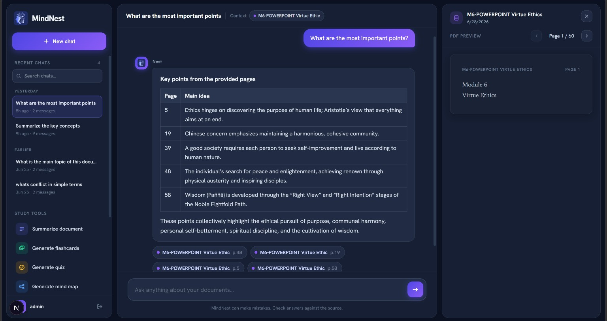
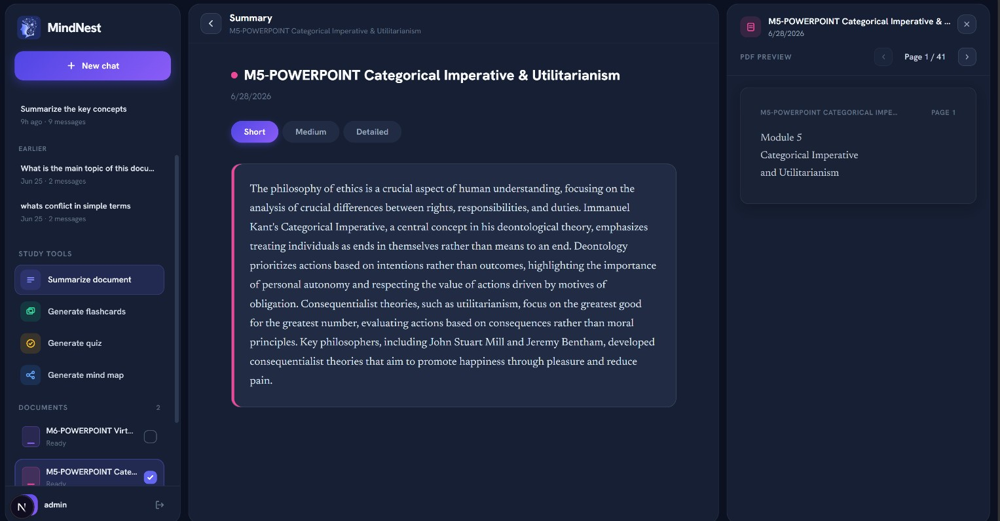
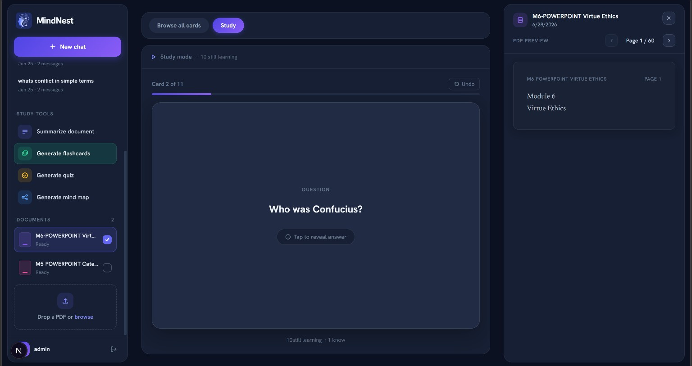
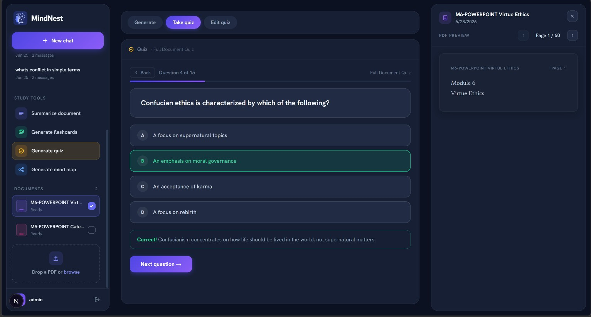
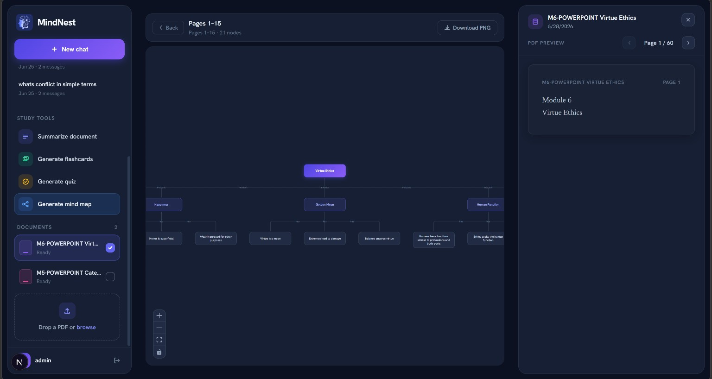

<div align="center">

# MindNest


</div>

> Upload a PDF and ask questions, generate flashcards, take quizzes, and explore mind maps — all grounded in citations back to the source.

---

## Live Walkthrough

### Landing


### Sign up / Sign in
 

### Chat with citations
Ask questions across your library — every answer links back to the page it came from.


### Summarize


### Flashcards


### Quiz


### Mind Map


---

## Problem

Studying from long PDFs is slow and passive:

- **No quick way in** — skimming a 60-page module just to find one answer wastes time
- **Answers without proof** — generic AI chat tools give confident answers with no way to verify them against the actual source
- **Passive reading** — no built-in way to turn a document into something you can actually rehearse against (flashcards, quizzes)
- **Scattered tools** — reading, note-taking, flashcard apps, and quiz generators all live in separate products

## Solution

MindNest turns a single PDF upload into a full study kit. Ask it questions and get answers with page citations you can click straight back to, or generate a summary, flashcard deck, quiz, or mind map from the same document — all backed by a retrieval pipeline over your own material, not the model's general knowledge.

---

## Core Features

### Chat (RAG with citations)
- **Retrieval-augmented answers** — each question is embedded and matched against the document's chunks in ChromaDB before the LLM ever sees it
- **Page-level citations** — every answer links back to the exact page(s) it was drawn from, shown alongside a live PDF preview
- **Multi-document context** — scope a chat session to one or several uploaded documents
- **Session history** — past conversations are saved and searchable

### Summarization
- Generate short, medium, or detailed summaries of a document, cached per length so repeat requests are instant

### Flashcards
- Auto-generate front/back flashcards from a document (optionally scoped to a topic or page range)
- Flip-to-study mode with a simple "still learning" / "know it" self-tracking status

### Quiz
- Auto-generate scored multiple-choice quizzes with explanations for each answer
- Edit, add, or remove questions after generation

### Mind Map
- Extracts a root topic, branch themes, and leaf-level details into a visual node graph (via React Flow + Dagre layout)

---

## App Flow

```
1. Upload a PDF
        ↓
2. Text extracted per page → chunked → embedded (sentence-transformers)
        ↓
3. Chunks + embeddings stored in ChromaDB, keyed by document
        ↓
4. Pick a study tool:
   • Chat        → retrieve top-matching chunks → LLM answer + page citations
   • Summarize   → chunk summaries combined into one cohesive summary
   • Flashcards  → LLM generates front/back cards from the scoped content
   • Quiz        → LLM generates multiple-choice questions + explanations
   • Mind Map    → LLM extracts a root/branch/leaf concept graph
        ↓
5. Everything is saved per-document, so you can come back and keep studying
```

---

## Tech Stack

**Frontend** — Next.js 16 (App Router), React 19, TailwindCSS 4, React Flow + Dagre (mind maps), Framer Motion

**Backend** — FastAPI, SQLAlchemy + SQLite, ChromaDB (vector store), sentence-transformers (embeddings), Groq (LLM inference), PyMuPDF (PDF text extraction), JWT cookie auth

---

## Local Setup

Prerequisites: Node.js 18+, Python 3.11+, a free [Groq API key](https://console.groq.com/keys).

<details>
<summary><strong>Backend (FastAPI)</strong></summary>

```bash
cd backend
python -m venv .venv
.venv\Scripts\activate      # Windows
# source .venv/bin/activate  # macOS/Linux
pip install -r requirements.txt
```

Create `backend/.env`:

```env
DATABASE_URL=sqlite:///./mindnest.db
UPLOAD_DIR=storage/uploads
CHROMA_DIR=storage/chroma
GROQ_API_KEY=your_groq_api_key
SECRET_KEY=change-this-in-production
```

```bash
uvicorn app.main:app --reload
# Runs on http://localhost:8000
```

</details>

<details>
<summary><strong>Frontend (Next.js)</strong></summary>

```bash
cd frontend
npm install
npm run dev
# Runs on http://localhost:3000
```

</details>

---

## Roadmap

- [ ] OCR support for scanned (non-text) PDFs
- [ ] Streaming chat responses
- [ ] Export flashcard decks / quizzes (CSV, Anki)
- [ ] Multi-file mind maps spanning a whole library
